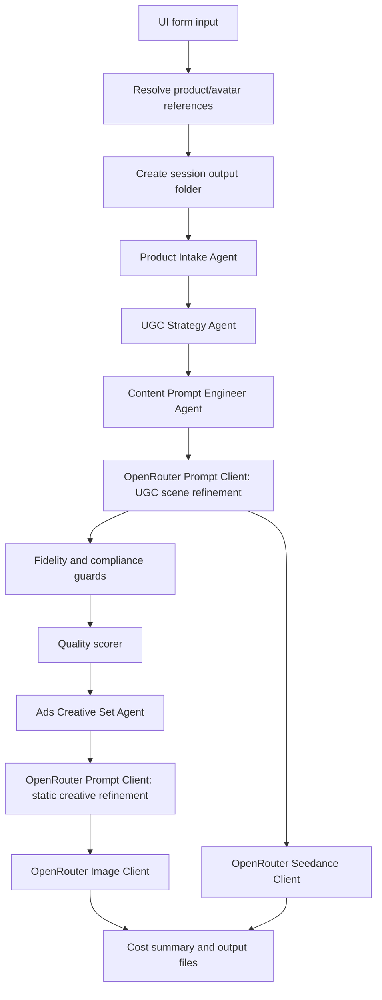

# App audit, workflow and prompt map

Generated: 2026-05-21  
Workspace: `C:\APP\SHOP`  
Local app: `http://127.0.0.1:8001/`

This document describes how the app currently works end to end: what data enters the workflow, which agents transform it, which prompts are fixed in backend code, which prompts are editable in the UI, when OpenRouter models are called, where generated prompts are stored, and why generation can be skipped or fail.

## 1. Executive summary

The app is a local campaign generator for paid ad creatives. It takes product data, product reference image, avatar reference image, market, platform, language, category, and prompt settings. It can generate:

- C1 UGC video prompt and optional Seedance video generation
- C2 static lifestyle PAIN image
- C3 static lifestyle IDENTITY image
- C4 static detail zoom DEMONSTRATION image
- C5 carousel with 5 educational/detail cards
- Meta/paid-social ad text variants
- Google Ads RSA and Performance Max text assets
- workflow report, prompt audit, payload audit, cost summary, and output folder

The key architectural point:

The app does not rely on only one prompt. It has layered prompts:

1. product intake and safety extraction
2. deterministic UGC strategy
3. deterministic content prompt package
4. optional OpenRouter prompt-model refinement for UGC video scenes
5. deterministic C1-C5 ads creative set
6. optional OpenRouter prompt-model refinement for static creative strategy
7. image rendering wrapper prompt for each image creative
8. final Seedance video payload prompt

If the prompt model fails, the app should continue with deterministic fallback prompts and show the reason in the output. If an image/video API call fails, the output includes `failure_reason`, `next_step`, and trace data.

## 2. Current default model settings

Source files:

- `app/config.py`
- `.env`
- `app/ui.py`

Current intended defaults:

| Purpose | Default |
|---|---|
| Prompt model for UGC and static creative refinement | `openai/gpt-5.4-mini` |
| Static image model | `google/gemini-3-pro-image-preview` |
| Video model | `bytedance/seedance-2.0-fast` |
| Image size | `1K` |
| Static images default max | cap only, no padding/duplicates |
| Avatar default URL | `https://i.ibb.co/6082rzf9/newkoi.png` |

Important: `max_static_images` is a maximum cap. It should not force duplicate images. If the cap is 4, the app selects the best 4 planned creatives and skips the rest with a visible reason.

## 3. UI settings that affect prompts

The UI has three practical groups:

### Product and campaign input

- `product_name`
- `product_info`
- `product_reference_url` or uploaded product image
- `product_category`
- `platform`
- `market`
- `language`
- `video_length`
- `resolution`
- generation mode: `both`, `video`, or `static`
- `generate_static_images`
- `image_model`
- `max_static_images`
- `image_size`
- `prompt_model`
- `seedance_model`

### Avatar input

- selected avatar
- `avatar_reference_url`
- custom avatar name
- custom avatar persona
- custom avatar voice
- wardrobe policy
- identity note
- `use_avatar_image_reference`

The app treats the avatar reference image as the identity source of truth. Text prompts should control motion, expression, speaking, wardrobe policy, camera, and environment. They should not re-describe static face/hair/skin/body details when image-to-video reference mode is active.

### Editable prompt settings

These are loaded from `GET /prompt-settings` and can be overridden in the UI per run:

- `content_prompt_system`
- `content_prompt_task`
- `base_video_prompt_template`
- `negative_prompt`
- category prompt preset fields for handbag, shoes, apparel

Overrides are used for the request. They are not written back to source code.

## 4. End-to-end workflow

Main orchestrator:

- `app/main.py`
- endpoint: `POST /generate`

High-level flow:



### Stage-by-stage map

| Stage | Source | AI model call? | Main output |
|---|---|---:|---|
| Normalize request | `app/main.py` | no | clean settings, mode, output folder |
| Product analysis | `app/services/product_intake_agent.py` | no | `product_analysis` |
| UGC strategy | `app/services/ugc_agent.py` | no | `ugc_strategy` |
| Prompt package | `app/services/content_prompt_engineer_agent.py` | no | `content_prompt_package` |
| UGC prompt refinement | `app/services/openrouter_prompt_client.py` | yes, if API key | `prompt_generation`, refined `seedance_payload.prompt` |
| Guards | `product_fidelity_guard.py`, `compliance_guard.py` | no | approval/block reasons |
| Quality score | `quality_scorer.py` | no | score and improvement advice |
| Ads creative set | `app/services/ads_creative_set_agent.py` | no | C1-C5 set, copy variants |
| Static creative prompt refinement | `app/services/openrouter_prompt_client.py` | yes, if API key | `static_prompt_generation`, improved static prompts |
| Image generation | `app/services/openrouter_image_client.py` | yes, if enabled | image files and image prompts |
| Video generation | `app/services/openrouter_seedance_client.py` | yes, if enabled | video payload/result |
| Report/export | `workflow_reporter.py`, `output_writer.py` | no | JSON/Markdown output |

## 5. Data priority rules

The app should prefer data in this order:

1. explicitly selected UI values
2. product reference image and product URL
3. user product name and product notes
4. selected product category
5. avatar reference URL/profile
6. editable UI prompt overrides
7. backend defaults and safety fallback prompts

Backend defaults are useful as safety rails and fallback structure. They should not override real user input unless the input is missing, unsafe, or unsupported.

## 6. Product Intake Agent

Source:

- `app/services/product_intake_agent.py`

Purpose:

- extracts safe product facts from `product_name`, `product_info`, category, and image/reference inputs
- separates user-provided facts from unsupported or risky claims
- creates short ad-safe detail phrases
- records product category and category source

Important outputs:

- `product_name`
- `likely_product_category`
- `requested_product_category`
- `known_product_facts`
- `user_provided_facts`
- `safe_benefits`
- `ad_safe_detail_phrases`
- `unsupported_claims`
- `safe_use_cases`
- `safest_creative_angle`
- `internal_brief_notes`

How product notes are used:

`product_info` is internal guidance. It can influence prompt direction, product category, detail phrases, and allowed visual context. It should not be copied verbatim into UGC voiceover, static overlay text, carousel text, or ad copy.

## 7. UGC Strategy Agent

Source:

- `app/services/ugc_agent.py`

Purpose:

- creates a deterministic safe UGC strategy before any AI prompt model is called
- chooses category-aware scenes
- writes hook, voiceover, scene plan, subtitles, and overlay text
- creates `voice_profile`, including British English direction for UK market

Important outputs:

- `hook`
- `scene_by_scene_script`
- `voiceover`
- `subtitles`
- `on_screen_text`
- `avatar_direction`
- `voice_profile`
- `category_video_recipe`

Category behavior:

| Category | UGC video direction |
|---|---|
| handbag | bag in hand/at frame edge, handle/opening/structure close-up, outfit or carry context, avatar closing |
| shoes | shoes worn on feet, low angle close-ups, side profile/sole/upper, no table or flat-lay default |
| apparel | garment worn, mirror/hallway/wardrobe detail, drape/seam/fabric movement |
| fallback product | product held, used, or shown in plausible real context |

The UGC strategy is deterministic. That means it is not itself calling a model. It prepares a safe, category-aware starting point. The optional prompt model can then rewrite the structured scene plan.

## 8. Content Prompt Engineer Agent

Source:

- `app/services/content_prompt_engineer_agent.py`
- `app/services/prompt_defaults.py`

Purpose:

- converts product analysis and UGC strategy into a Seedance-ready prompt package
- builds product fidelity instruction
- builds avatar identity contract
- injects category prompt directive
- builds deterministic structured scene fallback
- builds base video prompt and `seedance_payload`

Important outputs:

- `product_fidelity_instruction`
- `avatar_consistency_instruction`
- `avatar_identity_contract`
- `category_prompt_directive`
- `negative_prompt`
- `seedance_video_prompt`
- `structured_scene_prompt`
- `seedance_payload`
- `meta_ads_copy`
- `google_youtube_ads_copy`
- `ab_testing_variation_prompts`

This layer is still deterministic. It is the local fallback if OpenRouter prompt refinement is skipped or fails.

## 9. OpenRouter Prompt Client for UGC video

Source:

- `app/services/openrouter_prompt_client.py`
- function: `enhance_prompt_package`

When it runs:

- API key is present
- prompt model is set
- generation includes video prompt preparation

Request shape:

```json
{
  "model": "<prompt_model>",
  "temperature": 0.2,
  "messages": [
    {"role": "system", "content": "<content_prompt_system>"},
    {"role": "user", "content": "<JSON payload with task, product_analysis, ugc_strategy, avatar, current_prompt_package>"}
  ],
  "usage": {"include": true}
}
```

Expected response:

The model should return only a JSON object with `variants`. If valid, the first variant is compiled into the final Seedance prompt. If invalid or failed, the deterministic prompt package remains active and the failure is recorded in:

- `content_prompt_package.prompt_generation`

## 10. Core UGC system prompt

Source:

- `app/services/prompt_defaults.py`
- constant: `CONTENT_PROMPT_SYSTEM`
- editable in UI: yes

Short version of what it enforces:

- output only valid JSON
- avatar is the creator, not an actor
- first and last scenes must show avatar on camera
- product fidelity is strict
- product notes are internal guidance only
- selected category prompt controls shots, not facts
- avatar instruction must describe motion/action only when reference image is used
- UK/GB English should sound British, not American
- no in-creative buttons, CTA pills, URLs, click/tap wording
- no fake claims, reviews, discounts, medical claims, scarcity, or invented facts
- safe areas respected
- native Seedance scene durations used

Key excerpt:

```text
Every output is a paid UGC ad: conversational, slightly imperfect, never broadcast.
The avatar is the creator, not an actor playing one.
Product fidelity is non-negotiable: no recoloring, restyling, rebranding, or material substitution.
If market is UK/GB and language is English, use British English phrasing and write for a natural British creator voice.
Product notes, product_info, and internal_brief_notes are internal guidance only.
The ad platform supplies the final button, destination URL, and click target.
Do not put button-like CTA text, fake UI, clickable controls, "click", "tap", "ad button", "CTA button", "learn more", "shop now", "view details", "open detail", or equivalent wording into creative outputs.
```

## 11. Core UGC task prompt

Source:

- `app/services/prompt_defaults.py`
- constant: `CONTENT_PROMPT_TASK`
- editable in UI: yes

Current task intent:

```text
Create one structured variant for the selected product and the user's AI avatar.
Use the requested language, market, platform, aspect ratio, and duration from the input.
Build scenes that compile into a single OpenRouter /videos prompt while keeping the scene schema intact.
Pull product details only from the verified product brief; treat product_info and internal_brief_notes as guidance, never as voiceover or on-screen text.
Match avatar voice and register to the audience and market - for UK/GB English use natural British English phrasing and a subtle everyday British creator accent.
Avoid robotic category wording and passive phrasing.
Rewrite unsafe claims and log them in safety_rewrites.
Return only the JSON object defined in the system prompt output schema.
```

## 12. Base Seedance video prompt template

Source:

- `app/services/prompt_defaults.py`
- constant: `BASE_VIDEO_PROMPT_TEMPLATE`
- editable in UI: yes

Current template:

```text
Seedance image-to-video paid UGC ad, Aspect ratio {aspect_ratio}, {duration}s duration, platform {platform}, market {market}, language {language}. {avatar_instruction}, {scene_summary}, {fidelity}, dialogue "{voiceover}" spoken in {language}. Voice profile: {voice_profile}. Use natural conversational pacing and slight breath sounds, Category prompt: {category_prompt}. identity locked to reference image when avatar reference is supplied, no face morphing, no feature drift, smartphone footage shot on phone front camera, available natural light, slightly imperfect framing, unpolished, raw, no cinematic grading, no color correction, amateur creator self-recording. Use the avatar reference image only when use_reference_image is true. Use the product reference image for strict product fidelity. Keep all critical content inside platform safe areas. Negative prompt: {negative_prompt}
```

Available variables:

- `{duration}`
- `{platform}`
- `{language}`
- `{market}`
- `{fidelity}`
- `{avatar_instruction}`
- `{voiceover}`
- `{scene_summary}`
- `{aspect_ratio}`
- `{negative_prompt}`
- `{voice_profile}`
- `{category_prompt}`

## 13. Negative prompt

Source:

- `app/services/prompt_defaults.py`
- constant: `NEGATIVE_PROMPT`
- editable in UI: yes

Purpose:

- prevent product redesign
- prevent avatar drift
- prevent unsupported claims
- prevent fake reviews/discounts/social proof
- prevent in-creative CTA buttons and platform UI
- reduce common video/image artifacts

Current intent:

```text
Do not redesign the product. Do not change color, shape, material, logo, packaging, proportions, or visible markings.
Do not add luxury or designer branding, famous-brand comparisons, brand names not present in the product reference, medical, therapeutic, orthopaedic, weight-loss, or before/after claims, fake reviews, ratings, star counts, fake discounts, prices, fake scarcity or urgency, personal ownership or first-person usage testimonials, or invented certifications, awards, lab results, or endorsements.
Do not introduce a different person, swap or morph the avatar face, age, gender, ethnicity, hair, eye color, skin tone, body type, or wardrobe across scenes.
Do not render in-creative buttons, fake CTA pills, click/tap instructions, cursor elements, app UI, platform UI, or destination-link text; the advertising platform supplies CTA controls separately.
```

## 14. Category prompt presets

Source:

- `app/services/prompt_defaults.py`
- constant: `CATEGORY_PROMPT_PRESETS`
- editable in UI: yes

These presets are not product facts. They are directing layers for better category-specific shots.

### Handbag / tote bag

Focus:

- exact silhouette
- handles
- strap attachment
- stitching
- opening
- structure
- scale
- visible interior only if supported
- human scale: shoulder, hand, outfit/body context

Avoid:

- luxury/status framing
- fake capacity
- material changes
- brand/designer claims

### Shoes / footwear

Focus:

- worn on adult person
- upper shape
- sole profile
- closure
- stitching
- texture
- toe shape
- heel height
- side profile

Avoid:

- table/desk/flat-lay default
- orthopaedic or medical claims
- comfort guarantee
- posture, pain relief, transformation

### Apparel / clothing

Focus:

- garment worn by adult person
- cut
- drape
- seam placement
- neckline
- sleeve
- hem
- fabric look
- pattern
- colour

Avoid:

- body transformation
- slimming claims
- sizing guarantees
- invented material or fit claims

## 15. Structured UGC scene JSON contract

The prompt model should return:

```json
{
  "variants": [
    {
      "variant_id": "v1",
      "total_duration_seconds": 15,
      "language": "en",
      "market": "UK",
      "platform": "meta",
      "aspect_ratio": "9:16",
      "seedance_mode": "image_to_video",
      "reference_image_strategy": "original_avatar_for_first_scene_then_last_frame_chain",
      "scenes": [
        {
          "scene_id": "s1",
          "purpose": "hook",
          "duration": 5,
          "avatar_on_camera": true,
          "use_reference_image": true,
          "reference_image_source": "original_avatar",
          "avatar_instruction": "subject from reference image, identity preserved, no facial morphing, no appearance drift, looking directly into camera and speaking naturally, neutral relaxed expression with subtle smile forming, lips moving in sync with voiceover, wardrobe as in reference image, unchanged",
          "scene_summary": "creator intro with product visible, lived-in domestic setting with realistic background details, medium close shot with slight handheld camera sway and off-center framing, available natural window light, natural conversational pacing",
          "fidelity": "visible product shape and colors preserved, product not modified, not restyled, not recolored, not rebranded",
          "voiceover": "Exact spoken line",
          "on_screen_text": {
            "text": "Max six words",
            "position": "bottom_center"
          },
          "framing_notes": "Keep avatar face and product inside central safe area"
        }
      ],
      "stitching": {
        "transition_style": "hard cut",
        "cut_timing_notes": "Cut on natural sentence endings"
      },
      "safety_rewrites": [],
      "hypothesis": "Why this variant may work"
    }
  ]
}
```

## 16. Compiled Seedance prompt format

Source:

- `app/services/openrouter_prompt_client.py`
- function: `_compile_structured_prompt`

If the prompt model returns valid `variants`, the app compiles them into a single text prompt like:

```text
Create a paid UGC ad video from this structured scene plan.
Platform: {platform}. Market: {market}. Language: {language}.
Duration: {total_duration_seconds} seconds. Aspect ratio: {aspect_ratio}.
Seedance mode: {seedance_mode}. Reference strategy: {reference_image_strategy}.
Preserve product fidelity and, when avatar reference image is supplied, preserve the user's AI avatar identity without facial morphing or appearance drift.
Voice profile: {voice_profile}.
Category-specific product prompt: {category_prompt_directive}.
Scene s1 (...) | avatar_on_camera=... | use_reference_image=... | reference_image_source=... | avatar_instruction=... | scene_summary=... | fidelity=... | voiceover=... | on_screen_text=... | framing_notes=...
Stitching: hard cut; ...
Negative prompt: {negative_prompt}
```

This compiled prompt is what should be sent in:

- `content_prompt_package.seedance_payload.prompt`
- `seedance_payload.prompt`
- `video_generation.submitted_payload.prompt`

## 17. Seedance video payload

Source:

- `app/services/openrouter_seedance_client.py`
- `app/services/content_prompt_engineer_agent.py`

Payload concept:

```json
{
  "model": "<seedance_model>",
  "prompt": "<final Seedance prompt>",
  "duration": "<duration>",
  "aspect_ratio": "<aspect_ratio>",
  "resolution": "<resolution>",
  "input_references": ["<public product/avatar image references if allowed>"],
  "frame_images": [],
  "generate_audio": true
}
```

Rules:

- local `localhost` references are stripped for video API
- public product reference URLs can be sent
- avatar reference URL can be sent only when enabled and public
- data URLs are not sent to Seedance video API
- failures include human readable `failure_reason`

## 18. Ads Creative Set Agent

Source:

- `app/services/ads_creative_set_agent.py`

Purpose:

- generates the full C1-C5 media plan
- creates static image concepts
- creates carousel cards
- creates meme-style concepts as suggestions
- creates Meta/paid-social copy
- creates Google Ads RSA/PMax assets

Current C1-C5 plan:

| Set | Type | Angle | Ratio | Funnel | Budget |
|---|---|---|---|---|---:|
| C1 | UGC video | UGC | 9:16 | TOFU + retargeting | 55% |
| C2 | Static lifestyle | PAIN | 1:1 | TOFU + retargeting | 10% |
| C3 | Static lifestyle | IDENTITY | 1:1 | TOFU + retargeting | 10% |
| C4 | Static detail zoom | DEMONSTRATION | 1:1 | Retargeting | 10% |
| C5 | Carousel 5 cards | DEMONSTRATION | 1:1 | MOFU | 15% |

The app intentionally removed the old numbering gap. It now uses C1-C5 in order.

## 19. Static creative prompt model layer

Source:

- `app/services/openrouter_prompt_client.py`
- function: `enhance_ads_creative_set`

This is the layer that should make static creatives less repetitive. It calls the prompt model before image generation.

When it runs:

- API key is present
- ads creative set exists
- prompt model is set
- static generation is requested or static creative set needs refinement

System prompt intent:

```text
You are the Ads Creative Strategy and Prompt Engineer inside a paid social creative workflow.
Use product brief, product analysis, UGC strategy, platform, market, language, and category prompt to rewrite the actual creative strategy, not just polish wording.
Return ONLY valid JSON.
Preserve C1-C5 media architecture and IDs.
Treat existing creative text as a weak placeholder only.
Discard generic fallback wording and create fresh product-specific concepts.
Make every variation product-specific and materially different: distinct angle, setting, visual composition, prop logic, shot distance, overlay idea, and reason-to-care.
For static image creatives, prefer human-context images by default.
For bags: show the bag on shoulder, in hand, against an outfit, or being carried.
For shoes/apparel: show the product worn.
Static image concepts must be as realistic as possible.
Do not invent reviews, ratings, discounts, urgency, medical claims, luxury status, competitor comparisons, materials, brand facts, capacity claims, social proof, or performance claims.
Do not include destination URLs, button labels, fake CTA buttons, click/tap instructions, app UI, platform UI, or wording like ad button, CTA button, learn more, shop now, view details, open detail.
```

User payload includes compact versions of:

- product analysis
- UGC strategy context
- ads creative set
- category image directive
- creative plan
- static images
- carousel
- copy suggestions

The prompt model may update:

- `creative_angles`
- `hook_bank`
- `static_image_ads`
- `carousel_ad`
- `meme_style_creatives`
- `primary_text_variants`
- `ad_description_suggestions`
- `google_ads_assets`

It may not change:

- C1-C5 architecture
- IDs
- budget shares
- aspect ratios
- counts

Prompt budget:

```text
STATIC_CREATIVE_PROMPT_MAX_USER_CHARS = 18000
visual_prompt max 700
primary_text max 520
overlay_text max 48
headline max 64
hook max 140
meme copy max 260
```

If the prompt model returns invalid JSON, the app records:

- `static_prompt_generation.status = completed_with_fallback`

and continues with deterministic C1-C5 prompts.

## 20. Static image generation client

Source:

- `app/services/openrouter_image_client.py`
- function: `generate_ad_images`
- renderer: `_render_image_prompt`

The image client collects these creative sources:

- `ads_creative_set.static_image_ads`
- `ads_creative_set.carousel_ad.cards`
- optionally `ads_creative_set.meme_style_creatives`

Selection priority when `max_static_images` is lower than total planned assets:

1. C2 / PAIN
2. C4 / detail zoom
3. C3 / IDENTITY
4. C5 carousel cards in order

Max image policy:

```text
max_static_images is a cap only: the image client selects up to that many planned creatives and never pads the count with duplicate or extra creative types.
```

Duplicate prevention:

The app fingerprints each image request by:

- model
- rendered prompt
- aspect ratio
- image size
- product reference URL

If an identical request already succeeded, the duplicate API call is skipped and not added as a duplicate gallery asset.

## 21. Static image rendering prompt

Source:

- `app/services/openrouter_image_client.py`
- function: `_render_image_prompt`

Every image creative is wrapped into this prompt structure:

```text
Create one finished paid social static ad creative image.
Generate exactly one image for this one creative; do not create a collage, contact sheet, multi-panel set, or multiple variants in one image.
Creative set: {set_id}.
Creative angle: {angle}.
Funnel stage: {funnel_stage}.
Budget share context: {budget_share_percent}%.
Creative concept: {concept}.
Reason this angle exists: {why_this_angle}.
Asset type: {asset_type}.
Format: {format}.
Layout: {layout}.
Visual direction: {visual_prompt}.
Aspect ratio: {aspect_ratio}.
Human context requirement: include an adult person wearing, carrying, holding, trying on, or standing directly with the product whenever physically plausible for this product category. For bags, show the bag on shoulder, in hand, or against an outfit; for shoes or apparel, show the product worn. Cropped face, turned-away face, hands-only, torso-only, or off-frame head is acceptable. Use adults only; no children, public figures, celebrity likeness, or stock-photo glamour posing. Keep the product as the hero and preserve exact product fidelity.
Aim for the level of polish typical of a strong DTC brand ad: natural lighting, real materials, mid-saturation color, rule of thirds, clear central safe area, readable typography, no clutter, no platform UI mockups, no fake app chrome, no watermarks, no stock-photo feel, scroll-stopping but not overproduced.
Realism requirement: make the image look like a real photograph from a real camera, with physically plausible perspective, scale, shadows, highlights, lens behaviour, surface texture, and environmental context. Avoid AI-rendered gloss, plastic-looking materials, over-smoothed surfaces, surreal composition, impossible reflections, duplicated objects, distorted product geometry, synthetic studio render feel, and generic stock-photo staging.
Do not render buttons, CTA pills, clickable controls, tap/click instructions, cursors, destination URLs, platform UI, or app-like interface elements; the advertising platform supplies those controls outside the image.
Do not invent reviews, ratings, star counts, discounts, scarcity claims, certifications, medical effects, brand badges that are not in the product reference, or platform logos.
Preserve the product from the reference exactly: product not modified, not restyled, not recolored, not rebranded; exact shape, color, proportions, and visible markings.
Use the supplied product reference image as the source of truth for product appearance.
Render this overlay text exactly if legible: {overlay_text}
Use this copy only as context, not as a large block of text in the image: {primary_text}
```

The actual image API request:

```json
{
  "model": "<image_model>",
  "messages": [
    {
      "role": "user",
      "content": [
        {"type": "text", "text": "<rendered image prompt>"},
        {"type": "image_url", "image_url": {"url": "<product_reference_url or data URL>"}}
      ]
    }
  ],
  "modalities": ["image", "text"],
  "stream": false,
  "usage": {"include": true},
  "image_config": {
    "aspect_ratio": "1:1",
    "image_size": "1K"
  }
}
```

## 22. Ad copy and descriptions

Source:

- `app/services/ads_creative_set_agent.py`

The app creates:

- `ad_description_suggestions`
- `primary_text_variants`
- `google_ads_assets`

Meta/paid social rules:

- first line should survive the mobile "See more" cut
- no URL in copy
- no fake button instruction
- short paragraphs
- clear product detail framing

Google Ads rules:

- RSA headlines max 30 characters
- RSA descriptions max 90 characters
- PMax long headlines max 90 characters
- display paths max 15 characters
- final URL omitted from creative copy

## 23. Generation modes

The UI can choose:

| Mode | Meaning |
|---|---|
| `both` | prepare UGC video and static ads; generate both if enabled/API works |
| `video` | focus on UGC video; static image generation skipped |
| `static` | focus on static ads; video generation skipped |

The output display should show only what is actually planned/generated for the selected mode and max image cap.

## 24. Output folders and files

Every generation is saved into its own session folder under:

```text
C:\APP\SHOP\output\
```

Folder name format:

```text
YYYYMMDD_HHMMSS_ADS_ST_<product-slug>
```

Useful files:

| File | Purpose |
|---|---|
| `final_output.json` | full machine-readable generation output |
| `workflow_report.md` | human-readable campaign workflow report |
| `workflow_report.json` | structured workflow report |
| `openrouter_image_trace.jsonl` | per-image prompt/API trace |
| generated image files | static/carousel rendered assets |

Prompt fields to inspect inside `final_output.json`:

- `content_prompt_package.seedance_video_prompt`
- `content_prompt_package.structured_scene_prompt`
- `content_prompt_package.seedance_payload.prompt`
- `seedance_payload.prompt`
- `video_generation.submitted_payload.prompt`
- `ads_creative_set.ugc_video_ad.seedance_prompt`
- `ads_creative_set.static_image_ads[*].visual_prompt`
- `ads_creative_set.carousel_ad.cards[*].visual_prompt`
- `static_image_generation.static_prompt_generation`
- `static_image_generation.generation_plan[*].prompt_preview`
- `static_image_generation.image_assets[*].prompt`
- `static_image_generation.failures[*].prompt`

## 25. Failure and skip logic

### Prompt model skipped

Common cause:

- no OpenRouter API key

Where visible:

- `content_prompt_package.prompt_generation.status = skipped`
- `ads_creative_set.static_prompt_generation.status = skipped`

Impact:

- deterministic fallback prompts are used

### Prompt model failed

Common causes:

- model not available
- invalid key
- rate limit
- invalid JSON response

Where visible:

- `attempts`
- `error`
- `fallback_reason`

Impact:

- UGC video falls back to deterministic scene package
- static creative refinement falls back to deterministic C1-C5 prompts

### Static images skipped

Common causes:

- generation mode is `video`
- static image generation disabled
- no API key
- `max_static_images = 0`
- no renderable creatives

Where visible:

- `static_image_generation.image_generation_status`
- `failure_reason`
- `next_step`
- `generation_plan`
- `skipped_creatives`

### Static images failed

Common causes:

- selected image model does not support image output
- OpenRouter rate/credit limit
- provider safety filter
- invalid product reference URL
- provider returns no image URLs

Where visible:

- `static_image_generation.failures`
- `static_image_generation.failures[*].error`
- `static_image_generation.failures[*].failure_reason`
- `openrouter_image_trace.jsonl`

### Video failed

Common causes:

- Seedance model/provider not available
- local or non-public image references
- avatar reference rejected
- prompt or reference safety rejection
- OpenRouter rate/credit limit

Where visible:

- `video_generation.status`
- `video_generation.failure_reason`
- `video_generation.submitted_payload`

## 26. Cost tracking

Source:

- `app/services/cost_tracker.py`

The app aggregates known costs/usage from:

- prompt model calls
- static creative prompt model calls
- image generation calls
- video generation calls

If a provider does not return usage/cost metadata, the cost summary can be partial. The output should still show known cost and unknown cost areas.

## 27. Latest observed healthy state

Latest inspected output showed:

- product: `Kosile`
- category: `apparel`
- category source: user selected
- generation mode: `both`
- prompt model status: completed
- static prompt status: completed
- image status: completed
- image assets: 5
- video status: completed
- final export status: approved
- known cost: about `0.725121`
- output folder: `C:\APP\SHOP\output\20260520_215331_ADS_ST_ko-ile`

This means the current architecture is capable of completing both video and static generation when API/model/reference conditions are valid.

## 28. What is AI-generated vs hardcoded?

### AI-generated when API key/model works

- structured UGC scene prompt
- final refined Seedance prompt
- static creative strategy/prompt refinements
- image files
- video file/result

### Deterministic/hardcoded fallback

- product intake extraction
- baseline UGC strategy
- baseline scene plan
- baseline C1-C5 creative plan
- baseline static/carousel prompts
- copy validation rules
- max image selection logic
- duplicate prompt prevention
- compliance/fidelity guards
- output/report formatting

This is intentional. The deterministic pieces keep the app usable and auditable if model generation fails. The AI prompt model should improve specificity and variety, but the local fallback prevents a blank result.

## 29. Main risks still worth improving

1. The UGC strategy fallback is category-aware, but still template-driven. For top quality, the prompt model should almost always be available and visible in output.
2. Static creative output depends heavily on whether `enhance_ads_creative_set` returns valid JSON. The fallback is safe but less inventive.
3. Product image fidelity depends on the reference image quality and whether the provider respects it.
4. Avatar consistency for multi-scene video depends on provider support for image-to-video references and last-frame chaining. The prompt is prepared for this, but actual provider behavior can vary.
5. Some UI labels and audit sections can still be simplified so the user sees "what will be generated" before clicking.
6. Prompt presets exist for handbag, shoes, and apparel. More category presets would improve results for beauty, electronics, home, jewellery, and accessories.

## 30. Recommended next improvements

Recommended implementation order:

1. Add a "Prompt Audit" panel that shows exactly:
   - UGC prompt model requested/used
   - static prompt model requested/used
   - whether fallback was used
   - final Seedance prompt
   - final image prompts per C-set

2. Add a pre-generation "Creative Plan Preview":
   - C1 video yes/no
   - C2/C3/C4/C5 selected yes/no
   - skipped due to max cap
   - prompt source: AI refined or fallback

3. Add category presets:
   - beauty/skincare
   - jewellery
   - electronics
   - home decor
   - accessories

4. Add a strict "human context" mode switch for static images:
   - always on person
   - product-only allowed
   - mixed

5. Add prompt diff:
   - deterministic prompt before AI
   - prompt model output after AI
   - final payload prompt

6. Add provider capability validation before generation:
   - image model supports image output
   - video model supports `/videos`
   - reference URL is public
   - prompt size is within configured budget

## 31. Practical answer to the main concern

Does the app really use the data entered in the UI?

Yes, by design it uses:

- product name
- product info as internal guidance
- product category
- product reference URL/image
- avatar reference URL/profile
- market/language/platform
- prompt model
- image model
- generation mode
- prompt overrides

But there are two fallback layers. If prompt-model calls fail or are skipped, backend templates produce safe but more generic output. That is why the UI and output report must clearly show whether each prompt was AI-refined or fallback-generated.

The most important output fields for checking this are:

```text
content_prompt_package.prompt_generation.status
ads_creative_set.static_prompt_generation.status
content_prompt_package.seedance_payload.prompt
static_image_generation.image_assets[*].prompt
static_image_generation.generation_plan[*].prompt_preview
workflow_report
```

